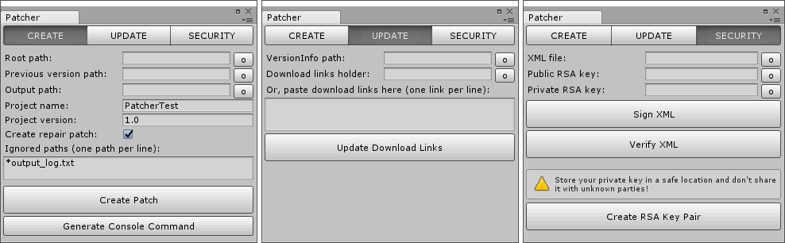
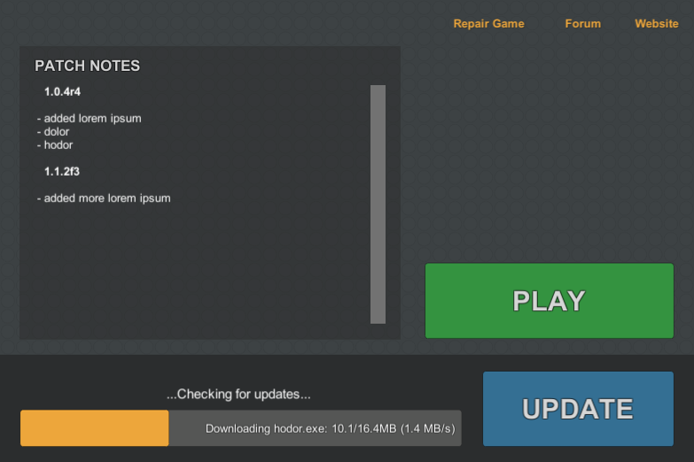
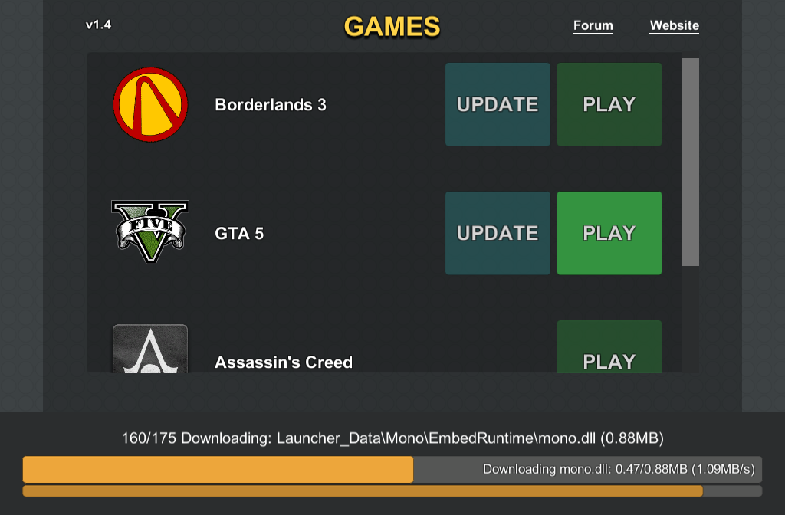

# Simple Patch Tool for Unity

**Available on Asset Store:** https://assetstore.unity.com/packages/tools/network/simple-patch-tool-124296

**Forum Thread:** https://forum.unity.com/threads/simplepatchtool-open-source-patching-solution-for-standalone-platforms.542465/

This plugin is a Unity port of [SimplePatchTool](https://github.com/yasirkula/SimplePatchTool), a general-purpose patcher library for **standalone** applications.

## LICENSE

SimplePatchTool is licensed under the [MIT License](LICENSE); however, it uses external libraries that are governed by the licenses indicated below:

- LZMA SDK - [Public Domain](https://www.7-zip.org/sdk.html)
- Octodiff - [Apache License, Version 2.0](https://github.com/OctopusDeploy/Octodiff/blob/master/LICENSE.txt)
- SharpZipLib - [MIT License](https://github.com/icsharpcode/SharpZipLib/blob/master/LICENSE.txt)

## SETUP

- import [SimplePatchTool.unitypackage](https://github.com/yasirkula/UnitySimplePatchTool/releases) to your project
- in **Edit-Project Settings-Player**, change **Api Compatibility Level** to **.NET 2.0** or higher (i.e. don't use *.NET 2.0 Subset* or *.NET Standard 2.0*)
- *(optional)* in **Edit-Project Settings-Player**, enable **Run In Background** so that SimplePatchTool can continue running while the application is minimized/not focused

## USAGE



1. take a look at the [Glossary](https://github.com/yasirkula/SimplePatchTool/wiki/Glossary) to familiarize yourself with the terms that are used throughout the documentation
2. [integrate SimplePatchTool to your project](https://github.com/yasirkula/SimplePatchTool/wiki/Integrating-SimplePatchTool) (you can also use the [PatcherWrapper](#patcherwrapper-component) component for simple integrations)
3. build the project
4. use **Window-Simple Patch Tool** to [create your first patch and push it to the server of your choice](https://github.com/yasirkula/SimplePatchTool/wiki/Creating-Patches)
5. whenever you update the app, create another patch and push it to the server
6. each time you push a new patch to the server, your clients will automatically fetch it and keep themselves up-to-date

For starters, you can inspect the [example scenes](#examples).

### Unity-specific Changes

To avoid any *Mono* related issues while applying patches in Unity, you should configure the *SimplePatchTool* instance as follows:

```csharp
SimplePatchTool patcher = new SimplePatchTool( ... )
// default IDownloadHandler implementation doesn't support https in Unity
.UseCustomDownloadHandler( () => new CookieAwareWebClient() )
// default implementation (DriveInfo.AvailableFreeSpace) throws NotImplementedException in Unity 5.6.2,
// so skip this stage until a Unity-compatible solution is found
.UseCustomFreeSpaceCalculator( ( drive ) => long.MaxValue );
```

Alternatively, you can call the [SPTUtils.CreatePatcher( string rootPath, string versionInfoURL )](Plugins/SimplePatchTool/Scripts/SPTUtils.cs) function which returns a Unity-compatible *SimplePatchTool* instance.

To check for updates/apply a patch and wait for the operation to finish in a coroutine, you can use the following *SimplePatchTool* extension functions: `CheckForUpdatesCoroutine` and `RunCoroutine`.

### PatcherWrapper Component

For simple patcher integrations, you can use the **Patcher Wrapper** component to quickly create a customizable patcher with a number of properties and events. Most of these customization options have tooltips or explanatory texts to help you understand what is what. To fill the *Version Info URL* field, see [Generating versionInfoURL](https://github.com/yasirkula/SimplePatchTool/wiki/Generating-versionInfoURL).

PatcherWrapper has the following properties and functions:

`string RootPath { get; }`: calculated root path of the application

`string ExecutablePath { get; }`: calculated path of the application's executable

`SimplePatchTool Patcher { get; }`: the *SimplePatchTool* instance this component is using to check for updates/apply patches. You should not call *SetListener* on this instance since it would prevent PatcherWrapper's events from getting invoked

`void CheckForUpdates()`: starts checking for updates

`void ApplyPatch()`: starts updating the application

`void RunSelfPatcherExecutable()`: if this is a self patching app, runs the self patcher to finalize the update. This should only be called if the patcher reports a successful patch (i.e. the *Patch Successful* event is an ideal place to call this function)

`void LaunchApp()`: launches the app (i.e. starts the app located at *ExecutablePath*). Can be useful for launchers launching the main app

`void Cancel()`: cancels the currently running operation

### Updating Dll's

This plugin uses SimplePatchTool's **SimplePatchToolCore** and **SimplePatchToolSecurity** modules without any modifications; so, if you want, you can make any changes to [these modules](https://github.com/yasirkula/SimplePatchTool), rebuild them and replace the dll files at *Plugins/SimplePatchTool/DLL* with the updated ones.

## EXAMPLES

**IMPORTANT:** take a look at the [Glossary](https://github.com/yasirkula/SimplePatchTool/wiki/Glossary) first to familiarize yourself with the terms that are used throughout the documentation.

Some of the example scenes use the [PatcherUI](Plugins/SimplePatchTool/Demo/PatcherUI.cs) prefab to show *SimplePatchTool*'s progress to the user; feel free to use it in your own projects, as well:


### [PatcherControlPanelDemo](Plugins/SimplePatchTool/Demo/PatcherControlPanelDemo.cs)


This scene lets you tweak some variables at runtime to quickly test some patches with different configurations. It can run on the Editor.

### [SelfPatchingAppDemo](Plugins/SimplePatchTool/Demo/SelfPatchingAppDemo.cs)

This scene allows you to quickly create and test a self patching app. It can't run on the Editor.

You can test this scene as follows:

- follow [these steps](https://github.com/yasirkula/SimplePatchTool/wiki/Generating-versionInfoURL) and paste VersionInfo's url to the **Version Info URL** variable of *SelfPatchingAppUI* in the Inspector
- tweak the value of **Check Version Only** as you like
- [create a SimplePatchTool-project for this app](https://github.com/yasirkula/SimplePatchTool/wiki/Project:-Create#via-unity-plugin)
- as this app uses self patching, we need a self patcher: [create a self patcher](https://github.com/yasirkula/SimplePatchTool/wiki/Creating-Self-Patcher-Executable) and put it inside the *SelfPatcher* directory of the SimplePatchTool-project
- enter the name of the self patcher's executable to the **Self Patcher Executable** variable of *SelfPatchingAppUI* in the Inspector
- create a subdirectory called `1.0` inside the *Versions* folder of the SimplePatchTool-project
- insert *SelfPatchingAppDemo* scene to the top of **Scenes In Build** list in *Build Settings* and then build the project. Afterwards, move the generated files into the `1.0` subdirectory
- follow [these steps](https://github.com/yasirkula/SimplePatchTool/wiki/Creating-Patches) to create a patch (you can skip the *Prerequisites*)
- you've created your first patch, great! Now, we should create a second patch to test the patcher. First, make some changes to the scene (e.g. add some cubes around, change the background of the camera)
- build the project again and move its files to another subdirectory called `1.1` inside the *Versions* folder of the SimplePatchTool-project
- [create another patch](https://github.com/yasirkula/SimplePatchTool/wiki/Creating-Patches)
- if you launch the version 1.0 of the app now, you'll see that it'll detect the 1.1 update and prompt you to update itself to that version, well done!
- also, if you had previously set *Check Version Only* to *false*, try deleting a redundant file from the app's Data directory (e.g. something from the *Mono/etc* subdirectory). When you launch the app, it will automatically detect the absence of the file and prompt you to update/repair itself

### [LauncherDemo](Plugins/SimplePatchTool/Demo/LauncherDemo.cs)



This scene allows you to quickly create a launcher that can update itself with self patching, in addition to patching and launching a separate main app. Launcher first checks if it is up-to-date (if not, updates itself with a self patcher) and then checks if the main app is up-to-date (if not, updates it directly, i.e. without using a self patcher). If you don't provide a VersionInfo url for one of these patches, that patch will be skipped. This scene can't run on the Editor.

It is recommended that you complete the [Self Patching App Tutorial](https://github.com/yasirkula/UnitySimplePatchTool#selfpatchingappdemo) before starting this tutorial.

- see the [recommended project structure for launchers](https://github.com/yasirkula/SimplePatchTool/wiki/Recommended-Project-Structure)
- [generate versionInfoURLs](https://github.com/yasirkula/SimplePatchTool/wiki/Generating-versionInfoURL) for the launcher and the main app and paste them to the **Launcher Version Info URL** and **Main App Version Info URL** variables of *LauncherUI* in the Inspector
- decide a **Main App Subdirectory** (let's say *MainApp*) and **Main App Executable** (let's say *MainApp.exe*)
- [create a SimplePatchTool-project for the launcher](https://github.com/yasirkula/SimplePatchTool/wiki/Project:-Create#via-unity-plugin)
- add `MainApp/` to the *IgnoredPaths* of the SimplePatchTool-project's *Settings.xml* (also give it a meaningful `<Name>` like *Launcher*)
- as the launcher uses self patching, we need a self patcher: [create a self patcher](https://github.com/yasirkula/SimplePatchTool/wiki/Creating-Self-Patcher-Executable) and put it inside the *SelfPatcher* directory of the SimplePatchTool-project
- enter the name of the self patcher's executable to the **Self Patcher Executable** variable of *LauncherUI* in the Inspector
- create a subdirectory called `1.0` inside the *Versions* folder of the SimplePatchTool-project
- insert *LauncherDemo* scene to the top of **Scenes In Build** list in *Build Settings* and then build the project. Afterwards, move the generated files into the `1.0` subdirectory
- follow [these steps](https://github.com/yasirkula/SimplePatchTool/wiki/Creating-Patches) to create a patch (you can skip the *Prerequisites*)
- you've created your launcher's first patch, awesome! Now let's generate a patch for the main app, as well
- [create another SimplePatchTool-project](https://github.com/yasirkula/SimplePatchTool/wiki/Project:-Create#via-unity-plugin), this time for the main app
- create a subdirectory called `0.1` inside the *Versions* folder of the SimplePatchTool-project
- build another one of your projects, name the executable as *MainApp.exe* and move the generated files into the `0.1` subdirectory
- follow [the same steps](https://github.com/yasirkula/SimplePatchTool/wiki/Creating-Patches) to create a patch for the main app (keep the launcher's and the main app's patch files in separate directories on the server)
- if you launch your launcher now, launcher should be able to detect the absence of the main app and prompt you to download/patch it (don't run the launcher inside the `1.0` subdirectory, that subdirectory will be used to create incremental patches later on, so we don't want its contents to be modified. Instead, create a copy of that subdirectory at some other location and run the launcher inside that directory)
- after letting the launcher download the main app, try deleting a file from *MainApp* and hit the *Repair Game* button in the launcher to test repairing the main app
- make some changes to the launcher's user interface, build the project again and move its files to another subdirectory called `1.1` inside the *Versions* folder of the launcher's SimplePatchTool-project
- [create another patch](https://github.com/yasirkula/SimplePatchTool/wiki/Creating-Patches) for the launcher
- if you launch the version 1.0 of the launcher now, you'll see that it detects the 1.1 update and prompts you to update itself to that version, well done!
- feel free to create a new version of the main app, as well

### [MultiGameLauncherDemo](Plugins/SimplePatchTool/Demo/MultiGameLauncherDemo.cs)



An example scene to demonstrate how you can use SimplePatchTool with your own Steam-like game hubs. Each game's configuration is stored in the *Games* variable of the *LauncherUI* object. You should complete the [Launcher Tutorial](https://github.com/yasirkula/UnitySimplePatchTool#launcherdemo) first.
